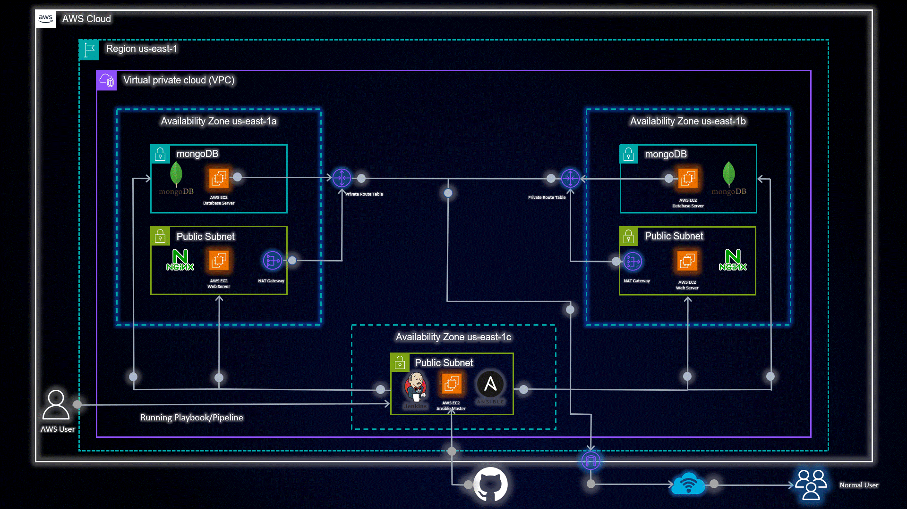

# Ansible Nginx Configuration

Welcome to the Ansible MongoDB Configuration repository! This repository contains Ansible playbooks and roles to configure MongoDB and setup the users for mongodb with ease. Use this README as your guide to get started and successfully configure MongoDB on your target hosts.

## Directory Structure

Here's a quick overview of the directory structure:

CICD-Ansible/
├── Ansible-Mongo-Role/
│   ├── hosts
│   ├── mongodb.yml
│   ├── mongodb/
│   │   └── tasks/
│   │       └── main.yml
│   └── mongodb_users/
│       └── tasks/
│           └── main.yml
└── Jenkinsfile

## Playbook Overview

The `mongodb.yml` playbook applies two roles, `mongodb` and `mongodb_users`, to the target hosts listed in the `hosts` file.

### Role Descriptions

- `mongodb`: This role installs and starts MongoDB on the target hosts, ensuring the MongoDB is up and running.

- `mongodb_users`: The tasks in this role clone and configure the users and database things. Once the playbook runs successfully, you'll have your Users and database will be configured on the MongoDB server.

## Getting Started

Follow these steps to configure MongoDB on your target hosts:

1. Clone this repository to your Ansible master server:

git clone https://github.com/nholuongut/cicd-ansible.git

2. Navigate to the `Ansible-Mongo-Role` directory:

cd CICD-Ansible/Nginx-Configuration

3. Open the `hosts` file and replace the IP addresses with the IP addresses of your target hosts:

[mongodb_servers]
server1 ansible_host=your-server1-ip
server2 ansible_host=your-server2-ip

4. Customize the `mongodb.yml` playbook as per your requirements. You can modify user credentials, adjust connection settings, etc.

5. Run the playbook with the following command:

ansible-playbook <playbook.yml>

## Feedback

We value your feedback! If you encounter any issues or have suggestions for improvements, feel free to open an issue in this repository.

## Jenkinsfile Explanation

The `Jenkinsfile` in this repository defines the pipeline to automate the Ansible playbook execution in Jenkins. It provides parameters for playbook name and action (Dry-Run or Playbook-deploy). The Jenkins pipeline will clone this repository, execute the Ansible playbook, and provide status updates.

Happy configuring with Ansible! :tada:
